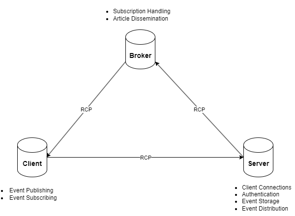

# Bulletin Board for School Events

This is the project conducted for the completion of the module Distribution Systems - 2024.

# Overall Architecture

The system will consist of three nodes a client, a broker, and a central server. 

**Server Node:** The Server node is responsible for listening for incoming client connections and managing client connections, authentication, event article storage, and distribution. As for communication, RPC (Remote Procedure Call) will be used for client-server communication. The data of client connections and subscriptions can be stored in the server and logs actions. 

**Client Node:** The client will connect to the server to publish event articles and subscribe to event categories. As mentioned earlier, for communication with the server RPC is used. It logs actions such as publishing events and subscribing to categories. Clients, teachers, and students, in this case, will connect to the server and authenticate themselves. Once authenticated, clients can send event articles to the server, specifying the category/tags for the article, request to subscribe to specific categories of events, and receive updates from the server when new events are published in the categories they subscribed to. 

**Broker Node:** The publish-subscribe software architecture is used for the system. The broker node acts as an intermediary node for distributing event articles to clients based on their subscriptions by handling subscriptions and article dissemination. This node logs events related to message routing and distribution.

## Communication Protocols

* To ensure reliable data communication between the client and server TCP/IP will be used.
* Publish-Subscribe architecture is used as the software architecture to allow clients to subscribe to specific categories of events and receive relevant updates. 
* RPC will be used for client-server communication.
* Multi-threading will be implemented on the server side to handle multiple client connections simultaneously.

## Topology Network

* The system will follow a centralized client-server architecture.
* Clients will connect to the server over TCP/IP sockets.
* The server will maintain a list of connected clients and manage the distribution of news articles.
* Broker has used a message queuing system acting as an intermediate node.

The topology of the system is shown in the below figure. 

